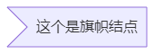

# Mermaid


:sparkle: 点此文章参考 [Mermaid 官方文档](https://mermaid-js.github.io/mermaid/#/)


## ⭐什么是 <font color="Orange">Mermaid?</font>


先别着急，我们通过一组图片展示 Mermaid 的魅力


第一次接触时我还在感叹，画图工具的精度也比不上 ==Mermaid==


### 1. 流程图

~~~mermaid
graph TD;
    A(这是一张使用Mermaid绘制的流程图)-->B([它的基础语法非常简单 易上手]);
    A-->C([许多编辑器和插件也支持Mermaid]);
    B-->D;
    C-->D{{今天我们着重讨论最常用的流程图}};
    
    style A fill:#00d26a, stroke: #333,stroke-width: 2px
    style B fill:#25aff3, stroke: #333,stroke-width: 2px
    style C fill:#25aff3, stroke: #333,stroke-width: 2px
    style D fill:#ffc019, stroke: #333,stroke-width: 2px
~~~


### 2. 时序图


### 3. 甘特图


### 4. 类图


咱学 Java的不陌生吧:cat:UML图


### 5. Git 图（实验功能）


依赖英文，展示还不支持中文（或许是我没发现啊）


### 6. 实体关系图（实验功能）


依赖英文，展示还不支持中文（或许是我没发现啊）


### 7. 个人旅行图


> Mermaid无所不能，实时渲染让我们的操作更为方便


## ⭐基础语法-流程图 (graph/flowchart)


首先我们先来了解流程图基础语法和布局结构

```markdown
TB - 从上到下
TD - 从上到下
BT - 从下到上
RL - 从右到左
LR - 从左到右
```


构建流程图的基础语法：

````markdown

````


> 明白了基础语法的构建，我们就可以开始选择形状了


### 1. 结点形状


#### 1.1 圆角矩形结点

```markdown
graph LR
    id1(这个是圆角矩形)
```

> 注意：这里的 `graph` 也可以替换为 `flowchart`，但是考虑到图形的兼容性，我更推荐使用 ==graph==


#### 1.2 跑道形结点

```markdown
graph LR
    id1([这个也是特殊的圆角矩形])
```


#### 1.3 子程序形结点

~~~markdown
graph LR
    id1[[这个是子程序结点]]
~~~


#### 1.4 圆柱形结点

~~~markdown
graph LR
    id1[(数据库)]
~~~

~~~mermaid
graph LR
    id1[(数据库)]
~~~


#### 1.5 圆形结点

```markdown
graph LR
    id1((这个是圆形结点))
```


#### 1.6 旗帜结点

```markdown
graph LR
    id1>This is the text in the box]
```





#### 1.7 菱形结点

```markdown
graph LR
    id1{这个是菱形结点}
```


#### 1.8 六边形结点

```markdown
graph LR
    id1{{六边形结点}}
```


#### 1.9 平行四边形和梯形

~~~markdown
graph LR
	id1[/平行四边形右倾斜/]
	id2[\平行四边形左倾斜\]
	id3[/上底梯形\]
	id4[\下底梯形/]
~~~

~~~mermaid
graph LR
	id1[/平行四边形右倾斜/]
	id2[\平行四边形左倾斜\]
	id3[/上底梯形\]
	id4[\下底梯形/]
~~~


### 2. 连接线


~~~markdown
graph TD
	A --> B
	C --- D
	a --文本--- b
	c ---|也可以这样|d
	E-->|也可以这样|F
	H-.->I;
	e-.文本.->f
	J ==> K
	j ==文本==> k
~~~

~~~mermaid
graph TD
	A --> B
	C --- D
	a --文本--- b
	c ---|也可以这样|d
	E-->|也可以这样|F
	H-.->I;
	e-.文本.->f
	J ==> K
	j ==文本==> k
~~~


~~~markdown
graph TD
    A -- text --> B -- text2 --> C
    a --> b & c--> d
    e & f--> h & i
    也可以
    e --> h
    e --> i
    f --> h
    f --> i
~~~


~~~mermaid
graph TD
    A -- text --> B -- text2 --> C
    a --> b & c--> d
    e & f--> h & i
~~~


由于 `graph` 不兼容此语法，故使用 `flowchart`

~~~markdown
flowchart TD
	A --o B
	B --x C
	
	D o--o E
    E <--> F
    F x--x G
~~~

~~~mermaid
flowchart TD
	A --o B
	B --x C
	
	D o--o E
    E <--> F
    F x--x G
~~~


***

至此，我们就完成了最基础的 Mermaid 语法学习


让我们尝试画画程序框图吧

~~~mermaid
flowchart TD
    A[Start] --> B{Is it?};
    B -- Yes --> C[OK];
    C --> D[Rethink];
    D --> B;
    B -- No ----> E[End];
~~~


![](https://www.zhihu.com/equation?tex=%5Cbegin%7Barray%7D%5Bb%5D+%7B%7Cc%7Cc%7C%7D++%5Chline+%E8%AF%AD%E6%B3%95+%26+%E6%B3%A8%E9%87%8A+%5C%5C++%5Chline+A---B++%26+%E6%97%A0%E7%AE%AD%E5%A4%B4%E8%BF%9E%E6%8E%A5++%5C%5C++%5Chline+A---%3EB++%26+%E6%9C%89%E7%AE%AD%E5%A4%B4%E8%BF%9E%E6%8E%A5++%5C%5C++%5Chline+A---text---B++%26+%E5%B8%A6%E6%96%87%E5%AD%97+%5C%5C++%5Chline+A---%7Ctext%7CB++%26+%E5%B8%A6%E6%96%87%E5%AD%97++%5C%5C++%5Chline+A---%3E%7Ctext%7CB++%26+%E5%B8%A6%E6%96%87%E5%AD%97++%5C%5C+++%5Chline+A-.-B++%26+%E8%99%9A%E7%BA%BF%E8%BF%9E%E6%8E%A5+%5C%5C++%5Chline+A-.text.-B++%26+%E8%99%9A%E7%BA%BF%E5%B8%A6%E6%96%87%E5%AD%97+%5C%5C++%5Chline+A+%3D%3D%3EB++%26+%E8%BF%9E%E6%8E%A5%E5%8A%A0%E7%B2%97+%5C%5C++%5Chline+A+--oB++%26+o%E7%AE%AD%E5%A4%B4%E7%B1%BB%E5%9E%8B%28%E9%9C%80flowchart%E6%94%AF%E6%8C%81%29+%5C%5C++%5Chline+A+--xB++%26+x%E7%AE%AD%E5%A4%B4%E7%B1%BB%E5%9E%8B%28%E9%9C%80flowchart%E6%94%AF%E6%8C%81%29+%5C%5C++%5Chline+A%3C--%3EB++%26+%E5%A4%9A%E5%90%91%E7%AE%AD%E5%A4%B4%28%E9%9C%80flowchart%E6%94%AF%E6%8C%81%29+++%5C%5C+%5Chline+%5Cend%7Barray%7D++%5C%5C++)

<font size="6rem">==总结==：</font>

| 长度                 | 1      | 2       | 3        |
| -------------------- | ------ | ------- | -------- |
| 默认（不带方向箭头） | `---`  | `----`  | `-----`  |
| 默认（带方向箭头）   | `-->`  | `--->`  | `---->`  |
| 加粗无向实线         | `===`  | `====`  | `=====`  |
| 加粗有向实线         | `==>`  | `===>`  | `====>`  |
| 无向虚线             | `-.-`  | `-..-`  | `-...-`  |
| 有向虚线             | `-.->` | `-..->` | `-...->` |

> 下一篇文章将会提到==破坏 Mermaid语法强行显示转义字符==、==显示流程图的子图==、==在结点中嵌入链接==、==使用css语法修改结点样式==
